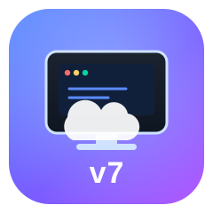

<div align="center">



# Maquina-v7

### ☁️ Cloud PC GNU/Linux con xrdp en Google Colab — controla tu escritorio remoto desde Android con RDP

[](https://colab.research.google.com/github/jephersonRD/Maquina-v7/blob/main/Maquina-v7.ipynb)
[](https://github.com/jephersonRD/Maquina-v7/stargazers)
[](https://github.com/jephersonRD/Maquina-v7/network/members)
[](https://github.com/jephersonRD/Maquina-v7/issues)
[](LICENSE)
[](https://github.com/jephersonRD/Maquina-v7/commits/main)


</div>

---

## 📖 Descripción

**Maquina-v7** convierte una sesión gratuita de **Google Colab** en un **escritorio remoto GNU/Linux**
(Xfce + `xrdp`) al que te conectas con el cliente **Microsoft Remote Desktop** directo desde
**Android**, Windows o macOS. A diferencia de otros proyectos que usan Moonlight/Sunshine (streaming
de video), Maquina-v7 usa el protocolo **RDP nativo** vía `xrdp`, lo que lo hace compatible con
cualquier dispositivo móvil sin instalar software extra.

Diseñado para las **nuevas reglas de Colab**: si Google otorga la GPU (T4), el entorno la aprovecha
para *cloud gaming* (Steam/Linux); si la sesión viene sin GPU, **degrada automáticamente a un
escritorio remoto en CPU** en lugar de apagarse. La conexión se hace por **Tailscale**, una VPN
privada de malla, para no exponer puertos públicos.

## ▶️ Código para Colab (copiar y pegar)

Pega **este único bloque** en una celda de Google Colab y ejecútalo.
**No descarga nada externo**: instala en la propia sesión (que ya es Linux)
el escritorio **Xfce4**, el servidor **xrdp** y **Tailscale**, y al final te
muestra la IP para conectarte por RDP. Te preguntará el usuario, la contraseña
y tu authkey de Tailscale paso a paso:

```python
# ===== Maquina-v7 (autocontenido: NO descarga nada de internet salvo paquetes) =====
# Instala Xfce + xrdp + Tailscale en la sesion de Google Colab y muestra la IP
# para conectarte por RDP (Microsoft Remote Desktop) desde Android / PC.
# Pega este bloque completo en una celda de Colab y ejecutalo.
import os
import time
import base64
import struct
import subprocess
import threading


def _wav_b64():
    sr, dur = 8000, 1
    data = bytes(sr * dur * 2)
    h = (b'RIFF' + struct.pack('<I', 36 + len(data)) + b'WAVE'
         + b'fmt ' + struct.pack('<IHHIIHH', 16, 1, 1, sr, sr * 2, 2, 16)
         + b'data' + struct.pack('<I', len(data)))
    return base64.b64encode(h + data).decode()


# ---- keep-alive (mantiene la sesion viva) ----
try:
    from IPython.display import display, HTML, Javascript
    display(HTML(
        '<b>🔊 Mantén esta pestaña ABIERTA y el audio en reproducción.</b><br/>'
        f'<audio autoplay src="data:audio/wav;base64,{_wav_b64()}" loop controls></audio>'))
    display(Javascript(
        "setInterval(function(){try{"
        "window.dispatchEvent(new Event('mousemove'));"
        "window.dispatchEvent(new Event('mousedown'));"
        "}catch(e){}}, 20000);"))
except Exception:
    pass


def _hb():
    while True:
        time.sleep(60)
        subprocess.run("curl -s -o /dev/null -m5 https://www.google.com",
                       shell=True, check=False)
        print("♥ keep-alive", time.strftime('%H:%M:%S'))


threading.Thread(target=_hb, daemon=True).start()

# ---- datos del usuario ----
USERNAME = input("👤 Usuario del escritorio RDP [v7user]: ") or "v7user"
PASSWORD = input("🔑 Contraseña [v7pass]: ") or "v7pass"
TS_KEY = input("🌐 Tailscale authkey (Enter = omitir Tailscale): ")

# ---- script bash embebido (se ejecuta en la misma maquina) ----
bash_script = r'''
echo "📦 Actualizando listas de apt..."
apt-get update -y

echo "🖥️ Instalando escritorio Xfce4 + xrdp (2-5 min)..."
apt-get install -y xfce4 xfce4-goodies xrdp xorgxrdp \
    tigervnc-standalone-server dbus-x11 x11-utils chromium-browser chromium
if ! command -v chromium-browser >/dev/null 2>&1 && ! command -v chromium >/dev/null 2>&1; then
  echo "   ↳ Chromium no disponible por defecto, usando PPA..."
  add-apt-repository -y ppa:savoury1/chromium
  apt-get update -y
  apt-get install -y chromium
fi

echo "👤 Creando usuario __USER__..."
id "__USER__" >/dev/null 2>&1 || useradd -m -s /bin/bash "__USER__"
echo "__USER__:__PASS__" | chpasswd
usermod -aG sudo "__USER__" 2>/dev/null
echo "xfce4-session" > /home/__USER__/.xsession
chown __USER__:__USER__ /home/__USER__/.xsession 2>/dev/null || true
printf '#!/bin/sh\nxfce4-session\n' > /etc/xrdp/startwm.sh
chmod +x /etc/xrdp/startwm.sh

echo "🚀 Iniciando servidor RDP (puerto 3389)..."
pkill -x xrdp 2>/dev/null; sleep 1
service xrdp restart 2>/dev/null \
  || (nohup xrdp-sesman -n >/tmp/sesman.log 2>&1 & nohup xrdp -n >/tmp/xrdp.log 2>&1 &)
sleep 3
if (ss -ltn 2>/dev/null | grep -q ':3389') || (netstat -ltn 2>/dev/null | grep -q ':3389'); then
  echo "✅ RDP escuchando en puerto 3389"
else
  echo "⚠️ 3389 NO escucha. Revisa: tail /tmp/xrdp.log"
fi

if [ -n "__TS__" ]; then
  echo "🌐 Instalando Tailscale..."
  curl -fsSL https://tailscale.com/install.sh | sh
  mkdir -p /var/run/tailscale
  pkill -x tailscaled 2>/dev/null; sleep 1
  tailscaled --tun=userspace-networking --state=/var/lib/tailscale/state \
    --socket=/var/run/tailscale/tailscaled.sock >/tmp/ts.log 2>&1 &
  sleep 5
  tailscale --socket=/var/run/tailscale/tailscaled.sock up \
    --authkey="__TS__" --hostname=maquina-v7 --accept-routes --netfilter-mode=off
  sleep 3
  IP=$(tailscale --socket=/var/run/tailscale/tailscaled.sock ip -4 2>/dev/null | head -n1)
  echo "📱 IP Tailscale: $IP   |   puerto 3389   |   usuario: __USER__"
  echo "(Ve https://login.tailscale.com -> Devices y APROBA 'maquina-v7' si aparece pendiente)"
else
  echo "ℹ️ Sin Tailscale. IP local de la sesion: $(hostname -I)"
fi

echo "✅ Maquina-v7 lista. Conectate por RDP con la IP de arriba."
'''
bash_script = (bash_script
               .replace("__USER__", USERNAME)
               .replace("__PASS__", PASSWORD)
               .replace("__TS__", TS_KEY))

print("\nEjecutando instalador... (tarda unos minutos)\n")
subprocess.run(bash_script, shell=True, executable="/bin/bash")
```

> 💡 Equivalente al viejo `ColabSteam`: tras ejecutarlo, contesta las
> preguntas en los cuadros de Colab y se instala todo automáticamente.
> Al final te muestra **la dirección exacta que debes poner en el RDP de Android**.

### 🌐 ¿Cómo te conectas desde Android?
- **Con Tailscale (recomendada, privada):** pega tu authkey gratis cuando el
  script la pida. Al terminar muestra la `IP Tailscale` (puerto `3389`).
  Ponla en *Microsoft Remote Desktop* de Android.
  ⚠️ Si no aparece conectado, ve a https://login.tailscale.com → **Devices**
  y **aprueba** el dispositivo `maquina-v7` (Colab lo crea nuevo cada sesión).
- **Sin Tailscale:** el script igual instala el escritorio; solo verás la IP
  local de la sesión (útil si conectas desde el mismo entorno, no desde fuera).

### ⚠️ No cierres la pestaña
Colab mata la sesión si **cierras** la pestaña del navegador. Mantenla abierta
(puedes minimizarla). El audio en silencio en loop + el heartbeat ayudan a que
no la suspenda mientras está abierta.

## ✨ Características

- 🖥️ **Escritorio Xfce4** completo con `xrdp` (protocolo RDP estándar).
- 📱 **Cliente Android**: usa la app oficial *Microsoft Remote Desktop* (ya viene con RDP).
- 🔐 **Tailscale**: red privada segura, sin abrir puertos ni usar ngrok frágil.
- 🎮 **Modo gaming**: detecta la GPU T4 de Colab y prepara Steam automáticamente.
- 🛡️ **Fallback a CPU**: si Colab no da GPU, el escritorio RDP sigue funcionando.
- 🔒 **Keep-alive integrado**: evita el cierre por inactividad de Colab.
- 📦 **100% open-source**: scripts propios, sin binarios cerrados ni `bit.ly` externos.

## 🚀 Inicio rápido

1. Abre el notebook con el botón **Open In Colab** de arriba.
2. En la celda **⚙️ Configuración** define:
   - `USERNAME` / `PASSWORD` → credenciales de tu escritorio RDP.
   - `TAILSCALE_AUTHKEY` → clave gratis en https://login.tailscale.com/admin/settings/keys
   - `INSTALL_STEAM = True` si quieres juegos (requiere sesión con GPU).
3. Ejecuta las celdas en orden: **Keep-Alive → Instalar RDP → Tailscale → (Steam)**.
4. En Android, abre *Microsoft Remote Desktop* y agrega:
   - **Dirección**: la `IP Tailscale` que muestra la celda de estado (puerto `3389`).
   - **Usuario** / **Contraseña**: los que definiste.

```bash
# Resumen de lo que hace cada script (también disponible en /scripts)
bash scripts/setup_rdp.sh <usuario> <password> [resolucion]   # Xfce + xrdp
bash scripts/setup_tailscale.sh <AUTHKEY>                     # VPN privada
bash scripts/install_steam.sh                                 # Steam si hay GPU
# O el todo-en-uno autocontenido:
python3 scripts/maquina_v7_colab.py                           # pide datos e instala todo
```

## 📋 Requisitos

| Software | Descripción |
|----------|-------------|
| 🔗 **Tailscale** | Cuenta gratuita + authkey para la red privada |
| 📲 **Microsoft Remote Desktop** | Cliente RDP en Android / iOS / Windows / macOS |
| ☁️ **Google Colab** | Sesión gratuita (GPU opcional, mejora el rendimiento) |

## 🏗️ Arquitectura

```
 Tu Android / PC
      │  RDP (3389) sobre Tailscale
      ▼
 ┌──────────────────────────────────┐
 │  Google Colab (contenedor Linux) │
 │   ├─ Xfce4 desktop               │
 │   ├─ xrdp  (servidor RDP)        │
 │   ├─ Tailscale (VPN mesh)        │
 │   └─ [Opcional] GPU T4 + Steam   │
 └──────────────────────────────────┘
```

> **¿Por qué Xfce + xrdp y no una VM anidada?** En Colab ya corres Linux con la GPU
> disponible de forma nativa. Montar el escritorio directamente aprovecha mejor los
> recursos y es mucho más estable que una VM KVM anidada; si Colab quita la GPU,
> conservas el escritorio RDP en CPU.

## 💻 Especificaciones de la máquina (típicas en Colab)

| 🧩 Componente | 📊 Especificación |
|--------------|-------------------|
| 🎮 GPU | NVIDIA Tesla T4 *(si la sesión la otorga)* |
| ⚡ CPU | Intel Xeon — 2 núcleos @ 2.0 GHz |
| 💾 RAM | ~12.7 GB |
| 🖥️ SO | Ubuntu (contendedor Colab) + Xfce4 |
| 🔌 Acceso | RDP 3389 vía Tailscale |

## ⚠️ Recomendaciones importantes

- ⏰ Revisa el tiempo restante de uso de Colab (se reinicia cada ~24 h).
- 🔉 **No ocultes ni cambies de pestaña** mientras uses la sesión (el keep-alive ayuda, pero la página debe permanecer visible/activa).
- 🔌 Desconéctate cuando no uses la máquina para aprovechar mejor el tiempo.
- 🎮 El gaming solo funciona si Colab asigna GPU; de lo contrario usa el modo escritorio.

## 🐛 Solución de problemas

| Síntoma | Solución |
|---------|----------|
| No conecta por RDP | Verifica la `IP Tailscale` y que el cliente use puerto `3389`. |
| `tailscale` no arranca | Usa `tailscale up --qr` y escanea con tu cuenta en el celular. |
| Sin GPU / Steam no juega | Normal: Colab dio sesión sin GPU. Usa el escritorio en CPU. |
| Colab se apaga | Mantén la pestaña visible y el audio del keep-alive en reproducción. |
| Tailscale no conecta | Confirma el authkey; ve a login.tailscale.com → Devices y **aprueba** `maquina-v7`. |
| 3389 no escucha | Revisa `tail /tmp/xrdp.log`; el contenedor debe permitir enlaces locales. |

## 📜 Licencia

Este proyecto se distribuye bajo la licencia **MIT**. Ver [`LICENSE`](LICENSE).

---

<div align="center">

Hecho con ❤️ para la comunidad de cloud gaming y远程桌面 · Maquina-v7

</div>
